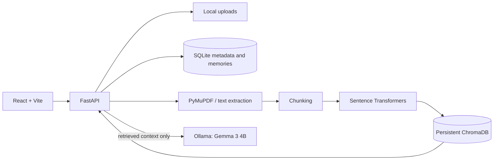

# Find My Thingy

**Your personal memory, ready when you need it.**

Find My Thingy is a local-first personal memory assistant. It indexes PDFs, text files and Markdown notes, retrieves relevant passages, then uses Gemma 3 4B through local Ollama to answer with source references. Your documents and indexes stay on your machine.

## Why Find My Thingy

Personal notes, class material and project documents are useful only when you can find the detail again. Find My Thingy creates a searchable local library and answers questions from retrieved passages, with document and page citations.

## Features

- Upload, search, inspect and delete PDF, TXT and Markdown documents.
- Extract PDF text page by page, split it into overlapping passages and index it persistently.
- Ask questions using local Gemma and see retrieved passages as citations.
- Save explicitly remembered personal facts in SQLite and extract optional facts and definitions from documents into Memory Library.
- Dashboard, model health, counts and local storage information.
- Duplicate detection by SHA-256 and a configurable upload size limit.

## Screenshots

Screenshots have not yet been captured. See docs/screenshots/README.md for the exact views and filenames to capture.

## Architecture

## Technology

React, TypeScript, Vite, Tailwind CSS, Lucide React, React Router, FastAPI, Pydantic, SQLite, ChromaDB, Sentence Transformers, PyMuPDF and Ollama.

## Local AI pipeline

Documents are validated, extracted and cleaned locally. PDF passages retain page numbers. The `all-MiniLM-L6-v2` model creates embeddings, which are stored in persistent ChromaDB. For a question, Find My Thingy retrieves up to five nearby passages and passes those passages to `gemma3:4b` over Ollama's local API. Citation filenames and pages are taken from stored passage metadata, not generated by the model. A relevance threshold declines unsupported questions.

Gemma 3 4B provides private, local inference without a paid AI API. Model quality and response time depend on local hardware. The embedding model may be downloaded once on first use if not cached. The frontend uses system fonts and has no runtime dependency on a hosted service.

## Windows setup (one-click local launcher)

1. Clone or download this repository.
2. Double-click `Install-FindMyThingy.bat` once. It checks Python, Node.js/npm and Ollama, installs dependencies, prepares local storage and offers to download Gemma only if it is missing and Ollama is available.
3. Double-click `Start-FindMyThingy.bat` whenever you want to use Find My Thingy. It selects available ports, starts and checks the local backend/frontend, then opens the browser.
4. Double-click `Stop-FindMyThingy.bat` when finished.

See [docs/WINDOWS_SETUP.md](docs/WINDOWS_SETUP.md) for prerequisites, troubleshooting, logs, port selection and data locations. This starts the existing local web app; it is not a standalone desktop executable.

Uploaded content, the SQLite database and ChromaDB live under ignored `storage/`. The app does not send document contents to a hosted AI service. Package or model setup may require internet access.

## Tests

Backend tests are in `backend/tests`; synthetic inputs are in `tests/fixtures/`. Run `python -m pytest -p no:cacheprovider --basetemp=..\storage\.pytest-run` from `backend` to keep temporary test files local and separate from the real library. Unit tests isolate SQLite/vector access and mock Ollama/embeddings. For a real Gemma check, launch the app, upload a synthetic note, ask a supported question, then an unrelated question and confirm the refusal.

## Known limitations

- Scanned PDFs are not OCR processed.
- Memory extraction is best effort and optional; source passages remain authoritative.
- The upload request processes synchronously, so large files and first-time model loading can take a while.
- Relevance filtering uses the Chroma collection's configured distance metric and a minimum similarity setting (`RETRIEVAL_MIN_SIMILARITY`, default `0.65`); tune it carefully for a particular library.
- Browser chat history is session-only.
- No authentication or multi-user mode is included; this is intended for a trusted local device.

## Future improvements

Background upload jobs and progress streaming, configurable retrieval tuning, more robust memory provenance, source passage inspection, and OCR as an opt-in local capability.

## Finalization materials

- Architecture and data flow: docs/architecture.md
- Safe synthetic demo note: docs/demo-sample.md
- 60–90 second recording plan: docs/demo-recording-script.md
- Screenshot capture checklist: docs/screenshots/README.md
- Local DEV submission draft: docs/submission-pack.md
