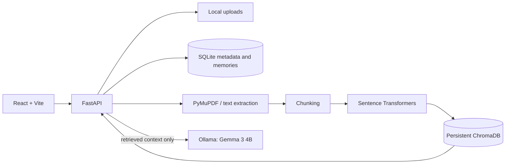

# Recall

**Your second brain. Your memories. Your control.**

Recall is a local-first personal memory assistant. It indexes PDFs, text files and Markdown notes, retrieves relevant passages, then uses Gemma 3 4B through local Ollama to answer with source references. Your documents and indexes stay on your machine.

## Why Recall

Personal notes, class material and project documents are useful only when you can find the detail again. Recall creates a searchable local library and answers questions from retrieved passages, with document and page citations.

## Features

- Upload, search, inspect and delete PDF, TXT and Markdown documents.
- Extract PDF text page by page, split it into overlapping passages and index it persistently.
- Ask questions using local Gemma and see retrieved passages as citations.
- Extract optional structured facts and definitions into a memory library.
- Dashboard, model health, counts and local storage information.
- Duplicate detection by SHA-256 and a configurable upload size limit.

## Screenshots

Screenshots will be added after a local demo capture.

## Architecture



## Technology

React, TypeScript, Vite, Tailwind CSS, Lucide React, React Router, FastAPI, Pydantic, SQLite, ChromaDB, Sentence Transformers, PyMuPDF and Ollama.

## Local AI pipeline

Documents are validated, extracted and cleaned locally. PDF passages retain page numbers. The `all-MiniLM-L6-v2` model creates embeddings, which are stored in persistent ChromaDB. For a question, Recall retrieves up to five nearby passages and passes those passages to `gemma3:4b` over Ollama's local API. Citation filenames and pages are taken from stored passage metadata, not generated by the model. A relevance threshold declines unsupported questions.

Gemma 3 4B provides private, local inference without a paid AI API. Model quality and response time depend on local hardware. The embedding model may be downloaded once on first use if not cached. The frontend uses system fonts and has no runtime dependency on a hosted service.

## Windows setup

Prerequisites: Python 3.12+, Node.js/npm, and Ollama. Recall does not install Ollama or download Gemma automatically.

1. Ensure `ollama list` includes `gemma3:4b` and Ollama is running.
2. Copy `.env.example` to `.env` if you need to change defaults.
3. In PowerShell, create a venv and install backend requirements:

   ```powershell
   cd backend
   py -3.12 -m venv .venv
   .\.venv\Scripts\Activate.ps1
   pip install -r requirements.txt
   uvicorn app.main:app --reload --port 8000
   ```

4. Download the embedding model once into Recall’s ignored local model directory. This setup step requires internet if the model is not cached:

   ```powershell
   cd backend
   $env:HF_HOME = (Resolve-Path ..\storage).Path + '\\models'
   python -c "from sentence_transformers import SentenceTransformer; SentenceTransformer('all-MiniLM-L6-v2')"
   ```

   In this environment, use the bundled Python executable if `python` is not on `PATH`. Recall itself only opens the embedding model from its local cache and never sends note contents to Hugging Face.

5. In a second PowerShell window:

   ```powershell
   cd frontend
   npm install
   npm run dev
   ```

6. Open http://localhost:5173. The API is at http://localhost:8000/api and interactive API docs at http://localhost:8000/docs.

Uploaded content, the SQLite database and ChromaDB live under `storage/`, which is ignored by Git. The app does not transmit document content to an external AI service. A first-time package/model setup can require internet access.

## Tests

Backend tests are in `backend/tests`. Run them in the activated venv with `python -m pytest`. Unit tests use isolated temporary storage and mocks for Ollama/embeddings; that does not establish real Gemma behavior. A real Gemma check is a separate manual integration step: upload a text or PDF file, ask a question supported by it, then ask an unrelated question and confirm refusal.

## Known limitations

- Scanned PDFs are not OCR processed.
- Memory extraction is best effort and optional; source passages remain authoritative.
- The upload request processes synchronously, so large files and first-time model loading can take a while.
- Relevance filtering is a simple cosine-distance threshold and can need tuning for a particular library.
- Browser chat history is session-only.
- No authentication or multi-user mode is included; this is intended for a trusted local device.

## Future improvements

Background upload jobs and progress streaming, configurable retrieval tuning, more robust memory provenance, source passage inspection, and OCR as an opt-in local capability.
